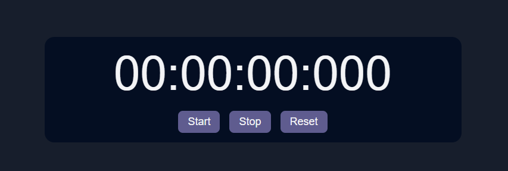
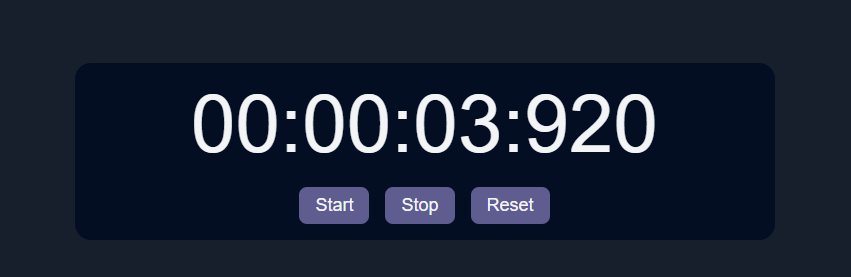

# Stopwatch

A simple stopwatch made using technology: HTML, CSS and JavaScript.  
This stopwatch represents the time in HH:MM:SS:MsMsMs, where "Ms" is milliseconds.  
The clock has functions **start**, **stop** and **reset**.  

# Screenshots

  

